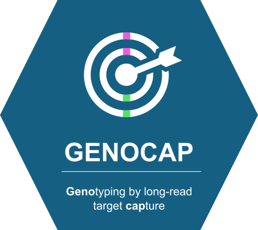

# GENOCAP
## *GENOtyping by long-read target CAPture pipeline*

<div align="center">




</div>

---

## 🌟 Overview

**GENOCAP** is a cutting-edge Nextflow pipeline engineered for comprehensive end-to-end analysis of PacBio HiFi sequencing data, specifically designed to characterize MHC gene diversity in mammalian species. This robust pipeline seamlessly integrates diploid-aware de novo assembly, sophisticated phylogenetic analysis, precise gene annotation, advanced variant calling, haplotype phasing, and individual genotyping into a unified workflow.

### ✨ Key Features

- 🔬 **Diploid-aware assembly** with hifiasm
- 🎯 **Target enrichment analysis** for capture validation  
- 🌳 **Phylogenetic clustering** for loci identification
- 📝 **Automated gene annotation** with multiple databases
- 🧬 **High-precision variant calling** using DeepVariant
- 🔗 **Haplotype phasing** with WhatsHap
- 📊 **Individual genotyping** with allele frequency analysis

---

## 🔄 Pipeline Workflow

The GENOCAP pipeline orchestrates **7 main analytical stages** in a streamlined workflow:

### 🧹 **Stage 1: Assembly and Quality Control**
- PCR duplicate removal with `pbmarkdup`
- Diploid-aware de novo assembly with `hifiasm`
- Assembly quality assessment with `Inspector`

### 🎯 **Stage 2: Target Enrichment Analysis**
- Target capture statistics with `Picard CollectHsMetrics`
- Mapping to reference genomes for enrichment validation

### 🔍 **Stage 3: Loci Identification**
- BLAST search against target panel sequences
- Multiple sequence alignment with `MAFFT`
- Phylogenetic clustering with `IQ-TREE` to identify putative loci

### 📝 **Stage 4: Gene Annotation**
- Reference sequence creation from consensus loci
- Gene annotation using `Exonerate` with NCBI databases
- Annotation refinement with `AGAT` tools

### 🧬 **Stage 5: Variant Calling and Phasing**
- HiFi read mapping to reference loci with `pbmm2`
- Variant calling with `DeepVariant`
- Haplotype phasing with `WhatsHap`

### 🔄 **Stage 6: Annotation Transfer**
- Annotation mapping to haplotypes with `Liftoff`
- Format conversion to EMBL with `EMBLmyGFF3`

### 📊 **Stage 7: Genotyping**
- Individual genotype determination
- Allele naming and frequency analysis

---

## 💻 System Requirements

### 🖥️ **Hardware Requirements**
- **OS**: Linux/Unix system
- **RAM**: Minimum 32GB recommended (64GB+ for large datasets)
- **Storage**: SSD recommended for optimal I/O performance
- **CPU**: Multi-core processor (8+ cores recommended)

### 🐳 **Software Dependencies**
- **Nextflow** 22.10.0 or later
- **Pixi** (for fast environment management)

> **Note**: We install DeepVariant via conda/pixi instead of Docker for better integration. Future versions will include a comprehensive Docker container with all tools.

---

## ⚡ Quick Start Installation

### 🚀 **1. Install Nextflow**
```bash
curl -s https://get.nextflow.io | bash
sudo mv nextflow /usr/local/bin/
```

### 📥 **2. Clone GENOCAP Repository**
```bash
git clone git@github.com:jwinternitz/LongReadGenotyping.git
cd LongReadGenotyping
```

### 🌟 **3. Install Pixi**
```bash
curl -fsSL https://pixi.sh/install.sh | bash
# Restart your shell or source your profile
```

### 🐍 **4. Setup Project Environment with Pixi**

**The beauty of pixi: ONE environment for everything!** 🎉

```bash
# Install ALL dependencies in one command
pixi install

# That's it! No multiple environments, no activation headaches!
```

#### **📄 pixi.toml - All tools in one place**
```toml
[project]
name = "genocap"
version = "1.0.0"
description = "GENOtyping by long-read target CAPture pipeline"
channels = ["bioconda", "conda-forge"]
platforms = ["linux-64", "osx-64", "osx-arm64"]

[dependencies]
# All tools in ONE environment - no mess!
pbmarkdup = "*"
seqkit = "*"
samtools = "*"
bedtools = "*"
blast = "*"
bcftools = "*"
tabix = "*"
hifiasm = "*"
minimap2 = "*"
inspector = "*"
exonerate = "*"
agat = "*"
gffread = "*"
liftoff = "*"
emblmygff3 = "*"
mafft = "*"
iqtree = "*"
biopython = "*"
pandas = "*"
numpy = "*"
whatshap = "*"
picard = "*"
deepvariant = "*"

[tasks]
run = "nextflow run genocap.nf"
test = "nextflow run genocap.nf --test"
clean = "rm -rf work/ .nextflow*"
```

### 🐳 **5. Optional: Docker Support**
```bash
# Docker is not required as we use conda/pixi for all tools
# But you can install it for future containerized versions
sudo apt update && sudo apt install -y docker.io
```

## 🚧 **Future Development**

### 📦 **Docker Container (Planned)**
We are planning to create a comprehensive Docker container that includes all GENOCAP dependencies for easier deployment and reproducibility. This will eliminate the need for local conda/pixi installations.

**Planned features:**
- Single Docker image with all tools pre-installed
- No local environment management needed
- Better portability across systems
- Simplified CI/CD integration

> **Issue**: Track progress on Docker containerization at [GitHub Issues](../../issues)

---

## 🔧 Usage Guide

### 🏃‍♂️ **Basic Execution**
```bash
# Just run it - pixi handles everything automatically!
pixi run run \
  --input_dir /path/to/hifi_reads \
  --reference /path/to/reference.fasta \
  --twist_targets /path/to/targets.bed \
  --species "Mus musculus" \
  --outdir results

# Or use the full nextflow command
pixi run nextflow run genocap.nf \
  --input_dir /path/to/hifi_reads \
  --reference /path/to/reference.fasta \
  --twist_targets /path/to/targets.bed \
  --species "Mus musculus" \
  --outdir results
```

### 📋 **Parameters Reference**

#### 🔴 **Required Parameters**
| Parameter | Description | Example |
|-----------|-------------|---------|
| `--input_dir` | Directory with HiFi reads | `/data/hifi_reads/` |
| `--reference` | Reference genome FASTA | `/ref/mm39.fa` |
| `--twist_targets` | Target panel BED file | `/targets/mhc.bed` |
| `--species` | Species name for annotation | `"Mus musculus"` |

#### 🟡 **Optional Parameters**
| Parameter | Description | Default |
|-----------|-------------|---------|
| `--outdir` | Output directory | `"results"` |
| `--project_name` | Project identifier | `"genocap_analysis"` |
| `--ncbi_gene_db` | NCBI gene database path | Auto-download |
| `--hifiasm_params` | Additional hifiasm parameters | `"-f0 -s 0.30"` |

### 📁 **Input File Structure**

#### HiFi Reads Format
```
input_dir/
├── sample1.hifi_reads.fastq.gz
├── sample2.hifi_reads.fastq.gz
├── sample3.hifi_reads.fastq.gz
└── sampleN.hifi_reads.fastq.gz
```

#### Reference Requirements
- **Format**: FASTA (.fa, .fasta)
- **Index**: Must be indexed with `samtools faidx`
- **Quality**: High-quality reference genome recommended

#### Target Panel Format
- **Format**: BED format with MHC gene coordinates
- **Columns**: chr, start, end, name (optional)

---

## 📊 Output Structure

```
results/
├── 📁 01_preprocessing/
│   ├── 🧹 nodup/              # PCR duplicate removed reads
│   └── 📈 stats/              # Sequence statistics
├── 📁 02_assembly/
│   ├── 🔧 hifiasm/            # Assembly outputs  
│   └── ✅ inspector/          # Quality control results
├── 📁 03_target_enrichment/   # 🎯 Enrichment metrics
├── 📁 04_loci_identification/
│   ├── 🔍 blast/              # BLAST results
│   ├── 📋 alignments/         # MAFFT alignments
│   └── 🌳 phylogeny/          # IQ-TREE results
├── 📁 05_annotation/
│   ├── 📝 exonerate/          # Gene annotations
│   └── 🧬 reference_loci/     # Reference sequences
├── 📁 06_variant_calling/
│   ├── 🗺️ mapping/            # Read alignments
│   ├── 🔬 deepvariant/        # Variant calls
│   └── 🔗 phasing/            # Phased haplotypes
├── 📁 07_genotyping/
│   ├── 📤 liftoff/            # Transferred annotations
│   ├── 📄 embl/               # EMBL format files
│   └── 🧬 genotypes/          # Final genotype calls
└── 📁 reports/                # 📋 Pipeline reports
```

---

## 🌍 Supported Species

### ✅ **Tested Species**
- 🐭 ***Mus musculus*** (House mouse)
- 🦡 ***Mungos mungo*** (Banded mongoose)

### 🔧 **Adaptable for Other Species**
The pipeline can be adapted for other mammalian species by providing:
- Species-appropriate reference genomes
- Customized target panels
- Species-specific annotation databases

---

## ⚙️ Configuration

### 🖥️ **Resource Configuration**
Edit `nextflow.config` to optimize for your system:

```groovy
process {
    withLabel: 'high_memory' {
        memory = '64 GB'
        cpus = 16
        time = '48h'
    }
    withLabel: 'medium_memory' {
        memory = '32 GB'
        cpus = 8
        time = '24h'
    }
    withLabel: 'low_memory' {
        memory = '16 GB'
        cpus = 4
        time = '12h'
    }
}
```

### 🏢 **HPC Configuration**
For cluster execution:

```groovy
process {
    executor = 'slurm'
    queue = 'normal'
    clusterOptions = '--account=myaccount --partition=compute'
    
    beforeScript = 'module load singularity'
}

singularity {
    enabled = true
    autoMounts = true
}
```

---

## 🔧 Troubleshooting

### ⚠️ **Common Issues**

#### 🐍 **Environment Problems**
```bash
# Check pixi installation and environment
pixi --version
pixi info

# List all installed packages
pixi list

# Update dependencies
pixi update

# Test critical tools
pixi run pbmarkdup --help
pixi run hifiasm --help
```

#### 💾 **Memory Issues**
- Increase memory allocation in `nextflow.config`
- Consider reducing parallel processes for memory-intensive steps
- Monitor system resources with `htop` or `top`

#### 🐳 **Docker Issues**
```bash
# Docker is optional in current version
# All tools are installed via pixi/conda including DeepVariant

# Verify DeepVariant installation
pixi run deepvariant --help
```

### 📋 **Debugging Tips**
- Check process logs: `work/[hash]/[hash]/.command.log`
- Use Nextflow tower for monitoring: `nextflow run -with-tower`
- Enable debug mode: `nextflow run -with-trace -with-report`

---

## 📚 Citation

If you use GENOCAP in your research, please cite:

```bibtex
@article{genocap2024,
  title={GENOCAP: A comprehensive pipeline for MHC gene diversity analysis using long-read sequencing},
  author={[Authors]},
  journal={[Journal]},
  year={2024},
  doi={[DOI]}
}
```

---

## 🤝 Contributing

We welcome contributions! Please follow these steps:

1. 🍴 Fork the repository
2. 🌿 Create a feature branch (`git checkout -b feature/AmazingFeature`)
3. 💾 Commit changes (`git commit -m 'Add AmazingFeature'`)
4. 📤 Push to branch (`git push origin feature/AmazingFeature`)
5. 🔄 Open a Pull Request

### 📋 **Contributing Guidelines**
- Follow conventional commit format
- Add tests for new features
- Update documentation as needed
- Ensure code passes all checks

---

## 📄 License

This project is licensed under the **MIT License** - see the [LICENSE](LICENSE) file for details.

---

## 💬 Support & Community

### 🆘 **Getting Help**
- 🐛 **Issues**: [Open an issue](../../issues) on GitHub
- 📖 **Documentation**: Check our comprehensive guides
- 💬 **Discussions**: Join our [GitHub Discussions](../../discussions)

### 🔗 **Useful Resources**
- [Nextflow Documentation](https://nextflow.io/docs/latest/)
- [PacBio HiFi Best Practices](https://www.pacb.com/wp-content/uploads/SMRT-Tools-Reference-Guide-v90.pdf)
- [MHC Analysis Guidelines](https://www.ebi.ac.uk/ipd/mhc/)

---

<div align="center">


---


</div>
